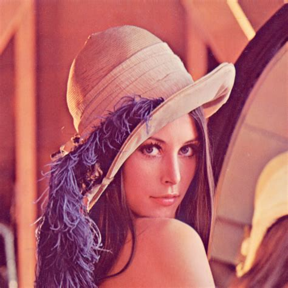

# Fractal Image Compression
This is my try to implement an image compression algorithm using the so called 'fractal compression'.
The theoretical approach can be found in the following book:
  - Fractal image compression theory and application Yuval Fisher ed. ISBN: 9780387942117
  
# Results
The results are somehow disappointing. The fact that the compressed images are very blurry can be attributed
to bugs and unoptimized code.
Also the encoding time is really bad. 

Image: Lena 474x474 - up to 1.5min

| Uncompressed             |  Compressed |
:-------------------------:|:-------------------------:
  |  
  |  
