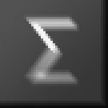

# Fractal Image Compression
This repository is an example implementation of the 'fractal compression' image compression algorithm described in "Fractal Image Compression: Theory and Application" by Yuval Fisher in 1995.

| Uncompressed             |  Compressed |
:-------------------------:|:-------------------------:
  |  
  |  
